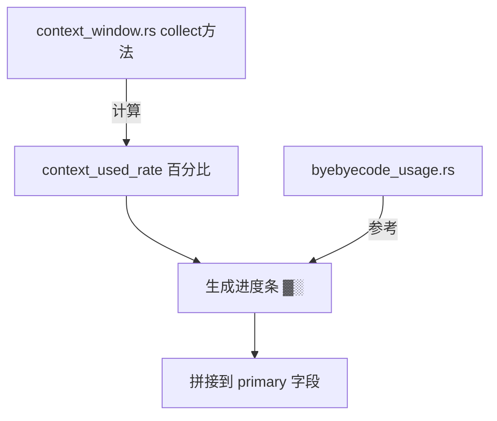

# 上下文摘要

> 生成时间: 2026-03-13
> 项目路径: I:\agentic-coding-proj\byebyecode

## 1. 任务概述

为 byebyecode 的 `context_window` segment 添加可视化进度条（`▓░`），类似 `bye_bye_code_usage` segment 已有的进度条功能。

**背景**：byebyecode 是 fork 自 CCometixLine 的 Claude Code statusline 工具，88code 额度显示已有进度条，但上下文窗口只显示纯文字百分比。

## 2. 进度状态

### 已完成

- [x] 调研 byebyecode 当前功能和版本（v1.1.28 → v1.1.29 Windows 二进制缺失）
- [x] 阅读 `context_window.rs` 源码确认无进度条
- [x] 阅读 `byebyecode_usage.rs` 源码找到进度条参考实现
- [x] Fork 仓库并 clone 到本地

### 待办

- [ ] 在 `context_window.rs` 的 `collect` 方法中添加进度条渲染
- [ ] 测试编译（需要 Rust 工具链）
- [ ] 提交并推送到 fork

## 3. 关键文件引用

| 文件 | 行号 | 说明 |
|------|------|------|
| `src/core/segments/context_window.rs` | 30~75 | `collect` 方法，输出 `primary: "{percentage} · {tokens} tokens"`，需要加进度条 |
| `src/core/segments/byebyecode_usage.rs` | 8~18 | `get_status_color` 三档颜色函数（绿/黄/红），可直接复用 |
| `src/core/segments/byebyecode_usage.rs` | 220~235 | 进度条渲染逻辑（`▓░` + 状态色），直接参考移植 |
| `src/core/statusline.rs` | 全文件 | statusline 渲染引擎，不需要修改 |

## 4. 依赖与流程

## 5. 关键决策与注意事项

- **进度条长度**：usage 用 10 格，context_window 建议也用 10 格保持一致
- **颜色逻辑**：usage 的三档色（≤50% 绿、50-80% 黄、>80% 红）可直接复用
- **v1.1.29 Windows 二进制缺失**：已知 bug，当前回退到 v1.1.28
- **改动范围极小**：仅需修改 `context_window.rs` 一个文件，约 15 行代码

## 6. 下次继续的入口点

直接编辑 `src/core/segments/context_window.rs`，在 `collect` 方法的 `Some(context_used_token)` 分支中，参考 `byebyecode_usage.rs` 的进度条逻辑，将 `primary` 字段从纯文字改为带进度条的格式。
